# Herald - Multi-channel Notification System

Herald is a multi-channel notification system built with Java Spring Boot. Developed as a study project , it handles the scheduling, prioritization, and delivery of alerts via Email and Telegram. The system is designed with security in mind, featuring built-in authentication and encryption at rest for all transmitted data.
## 🛠 Architecture

The system relies on a microservices architecture, utilizing both REST APIs and asynchronous messaging via RabbitMQ. This ensures that each service maintains its own domain logic and independent data persistence, allowing for robust scalability.

### Services
Each microservice is entirely decoupled and can be deployed independently:

* **herald-gateway:** It acts as the single entry point, receiving requests, authenticating users via herald-auth, and routing traffic to other services.

* **herald-auth:** It is strictly responsible for user authentication, API key management, and handling sensitive secrets across the application.

* **herald-scheduler:** It manages message scheduling logic and constantly polls for due messages, dispatching them to the main service for immediate processing.

* **herald-service:** It acts as the primary consumer for channel-specific queues, processes outgoing messages, and handles the final data persistence in the database.

### Shared Module

* **herald-shared:** A internal Maven library shared across services. It contains common domain models, DTOs, and exception definitions, avoiding code duplication across the system. It is not a deployable service — it is packaged and installed locally as a dependency during the build process.

#### Application flow diagram

(Open image in a new tab to take a better look) 
## 🧠 Architecture Evolution

This project was originally designed as a multi-repository microservices system, where each service was maintained in its own repository.

Later, it was migrated to a monorepo structure to simplify development, dependency management, and local orchestration.

Previous Structure (Multi-Repo)
- herald-service → https://github.com/YuriOlivs/notification-service
- herald-scheduler → https://github.com/YuriOlivs/notification-scheduler
- herald-shared → https://github.com/YuriOlivs/notification-shared

Why Monorepo?
- Simplified local development with a single docker-compose
- Easier dependency sharing via herald-shared
- Better version consistency across services
- Reduced overhead in managing multiple repositories

## ⚙️ Tech Stack

**Backend:** Java, Spring Boot (Spring Security, WebFlux)

**Database:** PostgreSQL

**Message Broker:** RabbitMQ

**Infrastructure:** Docker, Docker Compose

**Documentation:** OpenAPI / Swagger

**Other APIs:** Telegram API
## 📥 Installation

### Prerequisites
- Docker and Docker Compose installed
- Java 17+
- Maven

### Environment Variables

Create a `.env` file in the root of the project with the following variables:

```env
# Database — herald-service
SERVICE_DB_HOST=your_db_host
SERVICE_DB_USERNAME=your_db_username
SERVICE_DB_PASSWORD=your_db_password

# Database — herald-scheduler
SCHEDULER_DB_HOST=your_db_host
SCHEDULER_DB_USERNAME=your_db_username
SCHEDULER_DB_PASSWORD=your_db_password

# Database — herald-auth
AUTH_DB_HOST=your_db_host
AUTH_DB_USERNAME=your_db_username
AUTH_DB_PASSWORD=your_db_password

# PgAdmin
DB_ADMIN_EMAIL=your_pgadmin_email

# RabbitMQ
RABBITMQ_USERNAME=your_rabbitmq_username
RABBITMQ_PASSWORD=your_rabbitmq_password

# Security
AUTH_INTERNAL_KEY=your_internal_key
AUTH_ENCRYPTION_KEY=your_encryption_key

### Running the project

Clone the monorepo:

```bash
git clone https://github.com/YuriOlivs/herald
cd herald
```

Start all services:

```bash
docker-compose up --build
```
## 🚀 Deployment

The system is fully containerized. Each service has its own `Dockerfile` using multi-stage builds to keep images lean. The `docker-compose.yml` at the root orchestrates all services and infrastructure.

The only publicly exposed port is **8080** (herald-gateway) — all other services communicate internally through Docker's network and are not accessible from outside.

| Service | Internal Port |
|---|---|
| herald-gateway | 8080 (public) |
| herald-auth | 8083 |
| herald-service | 8081 |
| herald-scheduler | 8082 |
| RabbitMQ Management | 15672 |
| PgAdmin | 8084 |

## 

- Developed by [@YuriOlivs](https://www.github.com/YuriOlivs)

